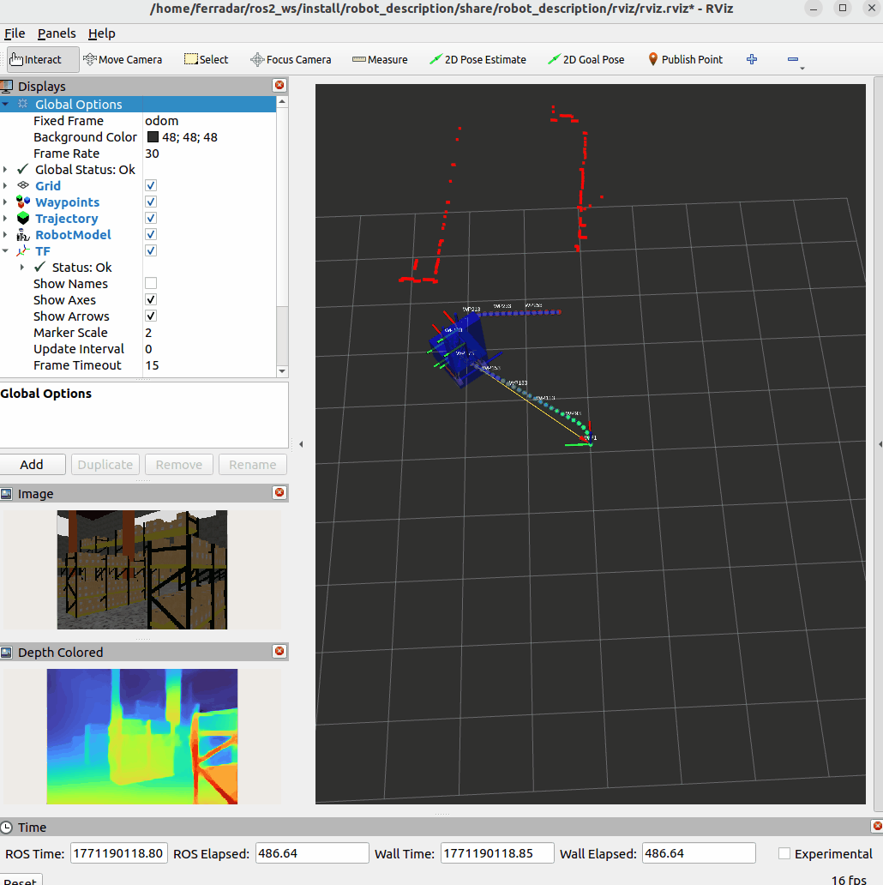

# Fergrbot (based on Nomeer Robot) - Autonomous Waypoint Navigation with Monocular Depth Vision & SLAM

A ROS 2 Humble-based autonomous robotic system featuring:
- **Waypoint-based autonomous navigation** with trajectory recording and playback
- **Real-time monocular depth estimation** using ONNX-accelerated AI (MiDaS)
- **Real-time SLAM** (Simultaneous Localization and Mapping) for autonomous environment mapping
- **Obstacle detection** with emergency stop capabilities



## System Setup from Scratch (Ubuntu)

**Prerequisites: Ubuntu 22.04.5 or similar**

> **Tip:** See [Tested Configurations](#tested-configurations) below for verified setups (VirtualBox specs, GPU notes, etc.) before starting installation.

### 1. System Locale Configuration

Ensure proper locale for ROS 2:

```bash
sudo apt update && sudo apt upgrade -y
sudo locale-gen en_US en_US.UTF-8
sudo update-locale LC_ALL=en_US.UTF-8 LANG=en_US.UTF-8
export LANG=en_US.UTF-8
```

Verify locale setup:
```bash
locale  # Should show en_US.UTF-8 for LANG and LC_CTYPE at minimum
```

### 2. Add Official ROS 2 Repository

Install prerequisites:
```bash
sudo apt install software-properties-common curl -y
```

Add ROS 2 signing key:
```bash
sudo curl -sSL https://raw.githubusercontent.com/ros/rosdistro/master/ros.key \
  -o /usr/share/keyrings/ros-archive-keyring.gpg
```

Add ROS 2 repository:
```bash
echo "deb [arch=$(dpkg --print-architecture) signed-by=/usr/share/keyrings/ros-archive-keyring.gpg] http://packages.ros.org/ros2/ubuntu $(. /etc/os-release && echo $UBUNTU_CODENAME) main" | sudo tee /etc/apt/sources.list.d/ros2.list > /dev/null
sudo apt update
```

### 3. Install ROS 2 Humble Desktop

```bash
sudo apt install ros-humble-desktop -y
```

This includes ROS 2, RViz, and Gazebo Harmonic (Ignition Gazebo 6.x) with modern simulation support.

**Note on Gazebo**: This project uses **Gazebo Harmonic** (Ignition Gazebo 6), which is the current default in ROS 2 Humble. Do NOT install `ros-humble-gazebo-ros` (it's for the legacy Gazebo 11) or attempt other Gazebo versions. The correct packages (`ros-gz-sim`, `ros-gz-bridge`, `ros-gz-interfaces`) will be installed by `rosdep`.

### 4. Install Development Tools

```bash
sudo apt install git python3-colcon-common-extensions python3-rosdep python3-argcomplete python3-pip -y
```

### 5. Initialize rosdep

```bash
sudo rosdep init
rosdep update
```

---

## Quick Start (After System Setup)

### Step 1: Create workspace

```bash
mkdir -p ~/ros2_ws
cd ~/ros2_ws
source /opt/ros/humble/setup.bash
```

### Step 2: Clone the robot repository

Clone the repository into the current directory:
```bash
git clone https://github.com/Fergrrobotics8/robot_autonomous_patrol_mono_depth_onnx.git .
```

The `.` (dot) clones the repository contents directly into `~/ros2_ws/` without creating an extra subdirectory.

### Step 3: Install system and ROS dependencies

```bash
sudo apt update
rosdep install --from-paths src --ignore-src -r -y
```

### Step 4: Install Python dependencies

```bash
sudo pip3 install 'numpy<2' opencv-python onnxruntime PyYAML scipy torch timm onnx onnxscript
```

### Step 5: Build all packages

```bash
colcon build
source install/setup.bash
```

### Step 6: (NOT Necessary) Download AI model (only if you don't have it already in the folder)

> **Note:** If the model file `midas_v21_small.onnx` already exists in `src/nomeer_robot_ros2/src/mono_depth_onnx/models/`, you can skip this step. Run this only if you need to download or convert the model again.

```bash
cd src/nomeer_robot_ros2/src/mono_depth_onnx
python3 scripts/download_midas_model.py
cd ~/ros2_ws
```

### Pro Tip: Automatic Setup

Add this line to `~/.bashrc` to avoid sourcing every time you open a new terminal:
```bash
echo "source ~/ros2_ws/install/setup.bash" >> ~/.bashrc
```

**Important:** After modifying YAML configs or parameters, you must:
1. Run `colcon build` to rebuild packages
2. Source the setup in your current terminal: `source install/setup.bash` (or close and reopen terminal)

### Every Session

In each new terminal (unless you added the auto-setup line above):
```bash
cd ~/ros2_ws
source /opt/ros/humble/setup.bash
source install/setup.bash
```

## Part A: Autonomous Waypoint Navigation

### Starting the robot environment (Gazebo + RViz)

**IMPORTANT: Follow the order carefully!**

1. Terminal 1 - Start robot simulator:
```bash
ros2 launch robot_description robot.launch.py
```
   - Gazebo and RViz will open automatically
   - **IMPORTANT:** Press the PLAY button in Gazebo to start the simulation

2. Terminal 2 - Start SLAM (Mapping & Localization):
```bash
ros2 run autonomous_patrol slam
```
   - This builds the map and estimates robot pose in real-time
   - Wait 2-3 seconds for initialization

### Recording Waypoints

3. Terminal 3 - Teleoperate robot:
```bash
ros2 run teleop_twist_keyboard teleop_twist_keyboard
```

4. Terminal 4 - Start waypoint recorder:
```bash
ros2 launch autonomous_patrol record_waypoints.launch.py
```

5. Navigate the robot using keyboard in Terminal 3 (i/, forward/backward, u/o turn/advance, j/l turn, m/. backward turns)
6. Press Ctrl+C in Terminal 4 to save waypoints

Waypoints saved to: `src/nomeer_robot_ros2/src/autonomous_patrol/data/waypoints.yaml`

### Waypoint Recording Configuration

Edit the recording parameters:
```bash
gedit src/nomeer_robot_ros2/src/autonomous_patrol/config/autonomous_patrol_config.yaml

```

Key parameters under `record_waypoints`:
- `sampling_mode: "distance"` - Can be `"distance"` or `"frequency"` for recording strategy
- `sampling_frequency: 10.0` - Sampling rate in Hz (10 Hz = one waypoint every 100ms; increase for faster robots or higher accuracy)
- `min_distance_between_waypoints: 0.1` - Minimum distance in meters (ignores waypoints closer than 0.1m)

After modifying the config, rebuild and re-source:
```bash
colcon build
source install/setup.bash
```


## Part B: Monocular Depth Vision with AI

**Advanced Configuration**

### Depth Inference and depth metric 

For testing depth vision independently:

1. Terminal 1 - Start depth inference:
```bash
ros2 launch mono_depth_onnx inference.launch.py
```

You can view the depth coloured in the rviz visualizer and see if there is an obstacle in the terminal (CLEAR=NO OBSTACLE)

The viewer displays:
- Colored depth visualization (red=close, blue=far)
- Depth metrics in real-time

### Depth Configuration

Edit configuration file for advanced settings:
```bash
gedit src/nomeer_robot_ros2/src/mono_depth_onnx/config/mono_depth_config.yaml
```

Key parameters:
- `roi_x_start/roi_x_end`: Region of interest (horizontal, 0-1)
- `roi_y_start/roi_y_end`: Region of interest (vertical, 0-1)
- `obstacle_threshold`: Detection threshold (0=far, 1=close)
- `outlier_percentile_low/high`: Outlier filtering (5/95 = remove extreme 5%)

### Published Topics

The depth pipeline publishes:
- `/camera/depth_estimated` - Raw depth map (mono16, 0-65535)
- `/camera/depth_colored` - Colored visualization (BGR8)
- `/depth_metric/median_frontal_depth` - Median depth in ROI (0-1)
- `/depth_metric/min_frontal_depth` - Minimum depth in ROI (0-1)
- `/depth_metric/avg_frontal_depth` - Average depth in ROI (0-1)
- `/depth_metric/obstacle_detected` - Boolean flag (1=obstacle, 0=clear)

## Playing Back Trajectory

**No need to close anything** Simply:

1. In Terminal 5 (or a new terminal), start the waypoint follower:
```bash
ros2 launch autonomous_patrol follow_waypoints.launch.py
```

2. The robot will automatically follow the saved trajectory. Watch the visualization in RViz that is already open (sometimes you might need to click, to hide and show the waypoints, in order to refresh and show the latest ones only)

**Metrics** are automatically saved to: `src/nomeer_robot_ros2/src/autonomous_patrol/results/metrics.json`

### Waypoint Following Configuration

Edit the trajectory following parameters:
```bash
gedit src/nomeer_robot_ros2/src/autonomous_patrol/config/autonomous_patrol_config.yaml
```
Speed commands are published in the ros2 topic `/cmd_vel`

Key parameters under `follow_waypoints`:
- `waypoint_tolerance: 0.05` - Distance tolerance in meters (robot considers waypoint reached at ±5cm)
- `max_linear_velocity: 0.3` - Maximum forward/backward speed in m/s (controlled for precision)
- `max_angular_velocity: 0.8` - Maximum turning speed in rad/s (controlled for precision)

Adjust these parameters based on your precision requirements and environment:
```yaml
follow_waypoints:
  ros__parameters:
    waypoint_tolerance: 0.05           # Increase for less precision, decrease for more
    max_linear_velocity: 0.3           # Increase for speed, decrease for precision
    max_angular_velocity: 0.8          # Increase for agility, decrease for stability
    control_frequency: 20.0            # Higher = more responsive, more CPU usage
    use_yaw_control: true              # Enable/disable orientation control
```

After modifying the config, rebuild and re-source:
```bash
colcon build
source install/setup.bash
```

## Obstacle Detection Configuration

The autonomous navigation system includes real-time obstacle detection using monocular depth estimation:
- During waypoint following, if frontal depth median falls below the configured threshold, the robot **stops immediately**
- Obstacle event is logged in metrics.json
- Configure sensitivity in:

```yaml
# ~/ros2_ws/src/nomeer_robot_ros2/src/mono_depth_onnx/config/mono_depth_config.yaml
depth_metric:
  obstacle_threshold: 0.7  # Increase for less sensitivity, decrease for more
  roi_x_start: 0.15
  roi_x_end: 0.85
  roi_y_start: 0.15
  roi_y_end: 0.65
```

## SLAM: Simultaneous Localization and Mapping

Real-time SLAM for concurrent robot mapping and localization:

```bash
ros2 run autonomous_patrol slam
```

This runs concurrently with autonomous navigation:
- **Simultaneous Localization** - Estimates robot pose in real-time
- **Environment Mapping** - Builds live 2D/3D maps of the environment
- **Accurate Odometry** - Provides refined odometry for waypoint navigation

Published topics:
- `/map` - Generated 2D occupancy grid map
- `/tf` - Transformation tree (robot position and orientation)
- `/scan` - Processed sensor data

## Important Files

```
src/nomeer_robot_ros2/
├── src/
│   ├── autonomous_patrol/
│   │   ├── data/waypoints.yaml              # Recorded trajectories
│   │   ├── results/metrics.json             # Execution metrics
│   │   └── config/autonomous_patrol_config.yaml
│   ├── mono_depth_onnx/
│   │   ├── models/midas_v21_small.onnx      # AI modelAutonomous Waypoint Navigation with Monocular Depth Vision & SLAM (quitar la mierda de comandos bash) y el githuib slam ese que no pinta na
│   │   └── config/mono_depth_config.yaml
│   └── robot_description/
├── README.md
└── src/nomeer_robot_ros2/README.md          # Original project README
```

## Available ROS 2 Topics

### Autonomy (Part A)
- `/cmd_vel` - Robot velocity commands
- `/map` - SLAM-generated occupancy grid map
- `/tf` - SLAM transformation tree (robot pose and orientation)
- `/waypoint_follower/current_waypoint` - Current waypoint index
- `/waypoint_follower/status` - Status string

### Vision/Depth (Part B)
- `/rgb_image` - Input RGB image from camera
- `/camera/depth_estimated` - Raw depth map (mono16, 0-65535)
- `/camera/depth_colored` - Colored depth visualization (BGR8)
- `/camera_info` - Camera calibration information
- `/depth_metric/median_frontal_depth` - Median depth in ROI (0-1)
- `/depth_metric/min_frontal_depth` - Minimum depth in ROI (0-1)
- `/depth_metric/avg_frontal_depth` - Average depth in ROI (0-1)
- `/depth_metric/obstacle_detected` - Boolean flag (1=obstacle, 0=clear)


## Project Structure

```
ros2_ws/
├── README.md                          # This file - Main documentation
├── LICENSE                            # Apache 2.0 license
├── .gitignore                         # Git ignore file (excludes build/, install/, log/, data/)
├── data/
│   └── waypoints.yaml                 # Recorded waypoints (generated at runtime)
│
├── src/
│   └── nomeer_robot_ros2/
│       ├── README.md                  # Original project documentation
│       ├── Docs/                      # Documentation and images
│       │   ├── frames.png             # Robot TF frames visualization
│       │   ├── Gazebo.png             # Gazebo simulation screenshot
│       │   └── Rviz.png               # RViz visualization screenshot
│       │
│       └── src/
│           ├── autonomous_patrol/     # Part A: Waypoint navigation & SLAM
│           │   ├── launch/
│           │   │   ├── record_waypoints.launch.py
│           │   │   └── follow_waypoints.launch.py
│           │   ├── config/
│           │   │   └── autonomous_patrol_config.yaml
│           │   ├── data/              # Waypoint data
│           │   └── [Python source files & slam node]
│           │
│           ├── mono_depth_onnx/       # Part B: Monocular depth with ONNX
│           │   ├── launch/
│           │   │   └── inference.launch.py
│           │   ├── config/
│           │   │   └── mono_depth_config.yaml
│           │   ├── models/
│           │   │   └── midas_v21_small.onnx  # AI depth model
│           │   ├── scripts/
│           │   │   └── download_midas_model.py
│           │   └── [Python depth inference nodes]
│           │
│           ├── robot_description/     # Gazebo & RViz setup
│           │   ├── launch/
│           │   │   └── robot.launch.py
│           │   ├── config/
│           │   │   └── gazebo_bridge_config.yaml
│           │   ├── models/
│           │   │   └── nomeer_robot/
│           │   │       └── robot.sdf  # Robot URDF/SDF definition
│           │   ├── worlds/
│           │   │   └── tugbot_warehouse.sdf
│           │   └── rviz/
│           │       └── [RViz config files]
│           │
│           └── teleop_twist_keyboard/ # Keyboard teleoperation
│               └── [Python teleoperation node]
│
├── results/                           # Generated at runtime (not in git)
│   └── metrics.json                   # Execution metrics from autonomous navigation
│
├── build/                             # Generated during build (not in git)
├── install/                           # Generated during build (not in git)
└── log/                               # Generated during build (not in git)
```

**Key Directories:**
- `src/` - Source code and configuration files
- `build/` - Build artifacts (auto-generated, excluded from git)
- `install/` - Installed packages (auto-generated, excluded from git)
- `log/` - Build logs (auto-generated, excluded from git)

**Important Generated Files:**
- `data/waypoints.yaml` - Created when recording waypoints
- `results/metrics.json` - Created after running autonomous navigation

## System Requirements

**Pre-installation:**
- Ubuntu 22.04 LTS or similar
- sudo access
- Internet connection
- Locale: en_US.UTF-8 (required for ROS)

**Post-installation:**
- ROS 2 Humble
- Python 3.10+
- ONNX Runtime (installed via pip)
- OpenCV Python

Optional:
- NVIDIA CUDA for GPU acceleration

## Tested Configurations

### Virtual Machine (VirtualBox)

This project has been successfully tested on:

**VirtualBox 7.0.26 with Ubuntu 22.04.5 amd64**
- Download: [ubuntu-22.04.5-desktop-amd64.iso](https://releases.ubuntu.com/jammy/ubuntu-22.04.5-desktop-amd64.iso)
- ROS 2 Humble
- **Recommended VM Specs:**
  - RAM: 10 GB
  - Video Memory (VRAM): 128 MB
  - CPUs: 6 cores (or as many as your host allows)
  - Disk: 100 GB

**Important GPU Note:** When using VirtualBox:
- **Disable 3D hardware acceleration** if using AMD GPUs - Gazebo will display a blank window with acceleration enabled on AMD systems
- NVIDIA GPUs may work with acceleration, but it's safer to disable it if you encounter display issues

### Native Linux

The system works well on native Ubuntu 22.04 installations without the VM constraints.

## License

Registered under Apache 2.0 License.

---
